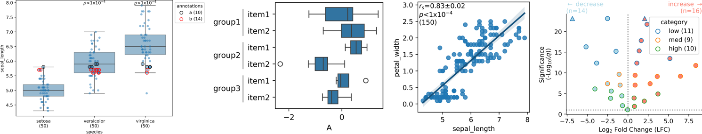

<!-- PROJECT SHIELDS -->
<div align="center">
  
<!-- [![Contributors][contributors-shield]][contributors-url]
[![Forks][forks-shield]][forks-url]
[![Stargazers][stars-shield]][stars-url] -->
[](https://pypi.org/project/roux)
[](https://github.com/rraadd88/roux/actions/workflows/build.yml)
[](https://github.com/rraadd88/roux/issues)
<br />
[](https://pepy.tech/project/roux)
[](https://github.com/rraadd88/roux/blob/master/LICENSE)
</div>
  
<!-- PROJECT LOGO -->
<div align="center">
  
  <h1 align="center">roux</h1>
  <p align="center">
    Streamlined scientific compute and workflow management toolkit.
    <br />
    <a href="https://github.com/rraadd88/roux#examples">Examples</a>
  </p>
</div>  

   

# Usage  

## Examples

[⌗ Dataframes.](https://github.com/rraadd88/roux/blob/master/examples/roux_lib_df.ipynb)  
[⌗⌗ Paired Dataframes.](https://github.com/rraadd88/roux/blob/master/examples/roux_lib_dfs.ipynb)  
[💾 General Input/Output.](https://github.com/rraadd88/roux/blob/master/examples/roux_lib_io.ipynb)  
[⬤⬤ Sets.](https://github.com/rraadd88/roux/blob/master/examples/roux_lib_set.ipynb)  
[🔤 Strings encoding/decoding.](https://github.com/rraadd88/roux/blob/master/examples/roux_lib_str.ipynb)  
[🗃 File paths Input/Output.](https://github.com/rraadd88/roux/blob/master/examples/roux_lib_sys.ipynb)  
[🏷 Classification.](https://github.com/rraadd88/roux/blob/master/examples/roux_stat_classify.ipynb)  
[✨ Clustering.](https://github.com/rraadd88/roux/blob/master/examples/roux_stat_cluster.ipynb)  
[✨ Correlations.](https://github.com/rraadd88/roux/blob/master/examples/roux_stat_corr.ipynb)  
[✨ Differences.](https://github.com/rraadd88/roux/blob/master/examples/roux_stat_diff.ipynb)  
[📈 Data fitting.](https://github.com/rraadd88/roux/blob/master/examples/roux_stat_fit.ipynb)  
[📊 Data normalization.](https://github.com/rraadd88/roux/blob/master/examples/roux_stat_norm.ipynb)  
[⬤⬤ Comparison between sets.](https://github.com/rraadd88/roux/blob/master/examples/roux_stat_sets.ipynb)  
[📈🔖Annotating visualisations.](https://github.com/rraadd88/roux/blob/master/examples/roux_viz_annot.ipynb)  
[🔧 Subplot-level adjustments.](https://github.com/rraadd88/roux/blob/master/examples/roux_viz_ax.ipynb)  
[📈 Diagrams.](https://github.com/rraadd88/roux/blob/master/examples/roux_viz_diagram.ipynb)  
[📈 Distribution plots.](https://github.com/rraadd88/roux/blob/master/examples/roux_viz_dist.ipynb)  
[📈 Wrapper around Series plotting functions.](https://github.com/rraadd88/roux/blob/master/examples/roux_viz_ds.ipynb)  
[📈📈Annotating figure.](https://github.com/rraadd88/roux/blob/master/examples/roux_viz_figure.ipynb)  
[📈💾 Visualizations Input/Output.](https://github.com/rraadd88/roux/blob/master/examples/roux_viz_io.ipynb)  
[📈 Line plots.](https://github.com/rraadd88/roux/blob/master/examples/roux_viz_line.ipynb)  
[📈 Scatter plots.](https://github.com/rraadd88/roux/blob/master/examples/roux_viz_scatter.ipynb)  
[📈⬤⬤ Plots of sets.](https://github.com/rraadd88/roux/blob/master/examples/roux_viz_sets.ipynb)  
[📈🎨✨ Visualizations theming.](https://github.com/rraadd88/roux/blob/master/examples/roux_viz_theme.ipynb)  
[⚙️🗺️ Reading multiple configs.](https://github.com/rraadd88/roux/blob/master/examples/roux_workflow_cfgs.ipynb)  
[⚙️⏩ Running multiple tasks.](https://github.com/rraadd88/roux/blob/master/examples/roux_workflow_task.ipynb)  
[⚙️⏩ Workflow using notebooks](https://github.com/rraadd88/roux/blob/master/examples/dev_workflow.ipynb)  
  
## CLI 

Requires the `workflow` extra (see [Installation](#installation)).

ℹ️ Available command line tools and their usage.  
`roux --help`

🗺️ Read configuration.  
`roux read-config path/to/file`  

🗺️ Read metadata.  
`roux read-metadata path/to/file`  

⭐ Replace `*` imports in a jupyter notebook with explicit imports.  
`roux replacestar path/to/notebook`  

💾 Archive a directory to a `.tar.gz` (⚠️ removes the original files).  
`roux to-arxv path/to/directory`  

# Installation  
Using [uv](https://docs.astral.sh/uv/) (recommended):
```
uv add roux                  # with basic dependencies
uv add "roux[all]"           # with all the additional dependencies (recommended).
```
With additional dependencies as required:
```
uv add "roux[viz]"           # for visualizations e.g. altair, upsetplot etc.
uv add "roux[data]"          # for data operations e.g. reading excel files etc.
uv add "roux[stat]"          # for statistics e.g. statsmodels etc.
uv add "roux[fast]"          # for faster processing e.g. parallelization etc.
uv add "roux[workflow]"      # for workflow operations and the `roux` CLI e.g. omegaconf etc.
```
Outside a uv project, use `uv pip install "roux[all]"`, or `uv tool install "roux[workflow]"` for only the CLI.  
Plain pip works too: `pip install "roux[all]"`.

For development:
```
uv sync --all-extras         # all extras + the dev group
```
  
# How to cite?  
```
@software{Dandage_roux,
  title   = {roux: Streamlined and Versatile Data Processing Toolkit},
  author  = {Dandage, Rohan},
  year    = {2024},
  url     = {https://zenodo.org/doi/10.5281/zenodo.2682670},
  version = {0.1.2},
  note    = {The URL is a DOI link to the permanent archive of the software.},
}
```
<!--   

# Future directions, for which contributions are welcome  
- [ ] Addition of visualization function as attributes to `rd` dataframes.  
- [ ] Refactoring of the workflow functions.   -->
  
# Similar packages
- https://github.com/v-popov/helper_funcs  
- https://github.com/nficano/yakutils  

<!-- # [API](https://github.com/rraadd88/roux/blob/master/README_API.md) -->